# Domino Dependency Mapping Visualization Tool

## Description
This application visualizes a service dependency map using the D3.js library. Users can upload a CSV file containing information about services and their dependencies, and view an interactive map that shows the relationships between services.

I started developing this small application during a train journey and it was completed during spare moments while playing with my son, who is passionate about Domino. He greatly appreciated the colorful graphics and the animation of the visualized services, which is why the chosen name is Domino Dependency Mapping Visualization Tool! :) 

## Features
- Upload CSV files containing service information.
- Display an interactive map of service dependencies.
- Search for specific services.
- View detailed information about services by clicking on nodes.
- Zoom and drag the map.
- Enriched fields derived from existing attributes (e.g., automatic Jira filter URLs).

## Repository Structure
domino-service-dependency-map/ ├── README.md ├── index.html ├── css/ │ └── styles.css ├── js/ │ ├── main.js │ └── d3.min.js ├── data/ │ └── sample.csv ├── assets/ │ └── images/ │ └── logo.png ├── docs/ │ └── documentation.md └── LICENSE


## Installation
1. Clone the repository:
   ```bash
   git clone https://github.com/your-username/domino-service-dependency-map.git
2. Navigate to the project folder:
cd domino-service-dependency-map
3. Install the dependencies:
   ```bash
   npm install
4. Compile the application:
   ```bash
   npm run build

## Usage
1. Open the `index.html` file in your browser (located in the `dist` folder).
2. Upload a CSV file using the upload button.
3. Use the search bar to find specific services.
4. Click on nodes to view detailed information about services.
5. Hide decommissioned services based on their Status field and Decommission Date values by clicking the dedicated CTA.
6. How to Search Using the Search Bar: You can refine your search using specific syntax. Below are examples and their meanings:
- key:"ServiceName1" → Searches for services with exactly the key-value pair key:"ServiceName1".
- "Value" → Searches for services that contain this value in any parameter.
- key:ServiceName1 → Searches for services that include a partial match for the key-value pair key:ServiceName1.
- key:ServiceName1,ServiceName2 → Performs a non-exact search for multiple services using comma-separated values.
- key:"ServiceName1","ServiceName2" → Performs an exact search for multiple services using comma-separated values.

## URL Parameters (Advanced Capabilities)
Solitaire supports optional URL parameters that extend or refine the visualization experience.
# stream
- stream=<name1,name2,...> — Isolate one or more Streams
  You can restrict the view to only the selected stream(s) by providing the stream parameter in the query string.
- Example:
  solitaire.html?stream=Order%20Management%20System
- or multiple streams:
  solitaire.html?stream=OMS,ERP,Replatforming

Effect: Only the selected streams are rendered on screen.
Themes, teams, and team members belonging to other streams are hidden.
The color legend dynamically adapts to show only the values present in the visible streams.

This is especially useful when sharing a focused view of a single functional area.

- advanced=true — Enable advanced editing tools
  By default, Solitaire runs in read‑only mode.
  Adding advanced=true unlocks additional capabilities:
  solitaire.html?advanced=true

Enabled features:

1. Upload CSV — Load a custom People Database export.
2. Change Scenario — Turn on drag‑and‑drop and resize mode for streams, themes, and teams.
3. Save Scenario — Store custom layout positions in the browser’s local storage.
4. Reset Scenario — Clear the saved layout and revert to the default arrangement.

This mode is intended for maintainers, editors, or users preparing custom visualizations.

## CSV Format
The CSV file should have the following format that are necessary for the dependency mapping visualization:
   ```bash
   Service Name,Description,Type,Depends on,Status,Decommission Date
   Service1,Service 1 description,Type1,Service2\nService3,Running,,
   Service2,Service 2 description,Type2,Service1,Stopped,03-16-2025,
   ```

Additionally, you can include other fields (columns) as desired. These fields will be displayed in the Service detail table section at the bottom, after clicking the single node service. 

# Solitaire: Org‑Chart & Team Explorer
## What it is
Solitaire is a companion application that renders the organizational chart and team/stream structure. It loads a CSV exported from the People Database on the dedicated Confluence page and provides a fast, filterable view of teams, streams, themes, and the services associated with each team. The People Database export typically includes individual‑level fields such as User, Role, Team link, Assigned team, Status, Company, Location, Room Link, In team since, Name, Company email, Photo, Stream.
For team‑level metadata like Theme, Team email, and role owners (e.g., Development Manager, Architect, Scrum Master, Product Manager, Delivery Manager), the Confluence Team Database includes those columns. [People Dat...ci Digital] [Team Datab...ci Digital]

Key Capabilities

Load a CSV exported from the People Database (Confluence).
Search and filter by:

- Team name
- Stream name
- Theme
- Services associated with teams


Click a team tile to see associated services and team metadata.
Navigate between team and stream views quickly.

## Usage (Solitaire)

Open solitaire.html (same bundle hosts both apps).
Click Upload CSV and select the People Database export (or a pre‑joined Team + People export).
Use the search bar to filter by team, stream, theme, or service.
Click a team tile to see services associated to that team (clickable list).


## CSV Format (Solitaire)

Each row is a person exported from the People Database (Confluence). Solitaire will group people by Assigned team to build team tiles; you can still filter by Stream, and you may add a Services column to the exported rows (or provide a separate mapping file) to enable service‑level filters. Typical People Database columns include: User, Role, Team link, Assigned team, Status, Company, Location, Room Link, In team since, Name, Company email, Photo, Stream. [People Dat...ci Digital]
Minimum required columns

Assigned team — Team name used for grouping.
Stream — Stream label (used for filtering).
Name — Person’s full name.

Recommended columns

Role, Company email, Team link, Status, Location, In team since — Improve richness of the team tiles and detail popovers. [People Dat...ci Digital]
Services — Optional; multi‑value list of services this person (or their team) is associated with. If present, Solitaire bubbles these up to the team.


``` bash
User,Role,Team member of,Leading team(s),Status,Company,Location,Room Link,In team since,Name,Company email,Photo,Stream,Team Stream,Team Theme,Team Development Manager,Team Architect,Team Delivery Manager,Team Scrum Master,Team Product Manager,Last Update,Team Managed Services
CSVName,Role,Assigned team,Stream,Company email,Team link,Status,Services
"Designer Name","UX Strategy","Foundation Digital Design","Replatforming Foundations","designer.name@Company.com","https://confluence/.../cb96a6d7-...","ACTIVE","Design System\nDesign Ops""Pinco Pallo","Delivery Manager","Delivery Management","Replatforming Foundations","pincopallo@company.com","https://confluence/.../02c2c794-...","ACTIVE","Platform Engineering\nAtlas""Mario Rossi","Product Manager","Teamcool","Replatforming themes","mario.rossi@company.com","https://confluence/.../d742fbd8-...","ACTIVE","PIM\nCatalog Enrichment"
```

## How Solitaire’s search works

Team name / Stream / Theme: exact or partial matches across the corresponding columns (Option A) or the aggregated values (Option B).
Services: matches any service string listed in the Services field. If aligned with Domino’s Service Name, results will be consistent across the two apps.

## Interoperability with Domino
To enable cross‑navigation between Solitaire and Domino:

Keep Solitaire → Services values identical to Domino → Service Name.
Use the same delimiter convention (\n inside quoted cells) for multi‑value fields to simplify parsing in both apps.

## Database Structure & Relationships (UML)
This section provides an Entity-Relationship (ER) UML diagram describing the logical connections between the main data sources used by Domino and Solitaire.
The diagram is based on the exported CSVs from Confluence:

- Streams Database: Macro-areas (streams) grouping product and business domains.
- Product Themes: Product or business themes, each belonging to a stream.
- Team Database: Teams, their members, and their association to themes and streams.
- People Database: Individual people, their roles, teams, and assignments.
- Service Catalog: Digital services, their dependencies, responsible teams, and associated themes.

The UML below shows how these entities relate and lists all available attributes for Person and Service as found in the CSVs.
This model helps developers, analysts, and maintainers understand how to join, filter, and extend the data for both visualization and reporting.
If I'll decide to move to a proper database, this would probably be the scheme I would follow. 

The underscore ('_') used on the field names is in the following uml just for visualization purposes and it is currently not considered by the current implementation of Solitaire and Domino.

```mermaid

erDiagram
    STREAM {
        string Id
        string Name
        string Description
        date   Last_Update
    }

    THEME {
        string Id
        string Name
        string Description
        string Jira_Theme_Field_Value
        date   Last_Update
        string Stream_Id
    }

    TEAM {
        string Id
        string Name
        string Description
        string Team_Page
        string Team_email
        string Development_Manager_Id
        string Architect_Id
        string Scrum_Master_Id
        string Product_Manager_Id
        string Delivery_Manager_Id
        string Security_Champion_Id
        string Administering_accounts_for
        string Stream_Id
        date   Last_Update
    }

    PERSON {
        string Id
        string Name
        string Company_email
        string Photo
        string Role
        string Status
        string Company
        string Location
        string Room
        date   In_team_since
        date   Last_Update
    }

    SERVICE {
        string Id
        string Service_Name
        string Description
        string Type
        string Owner_Person_Id
        string Owner_Team_Id
        string Code_Repository
        string Application_Performance_Monitoring
        string Security_Level
        string Audit_Log
        string Vendor_Management_References
        string Status
        string Business_Risk_Level
        string Technology_Risk_Level
        date   Go_Live_Date
        date   Decommission_Date
        string Jira_Service_Registry_link
        string Admin_consoles
        string Environments
        string Hosting_platform_references
        string Access_type
        string Legal_Compliance_Impact
        string Financial_Objective_Impact
        string Business_Objective_Impact
        string Reputational_Damage_Impact
        string Knowledge_base
        string Contingency_and_Recovery_Planning
        string Downtime_Targets
        date   Last_Update
        string Depends_on_Service_Ids
        string Used_by_Service_Ids
        string Responsible_Team_Ids
        string Theme_Ids
        string Access_Person_Ids
        string Approved_By_Person_Ids
        string Administered_By_Person_Ids
    }

    STREAM ||--o{ THEME : contains
    STREAM ||--o{ TEAM  : groups

    THEME }o--o{ TEAM  : includes
    THEME }o--o{ SERVICE : covers

    TEAM  ||--o{ PERSON : has

    TEAM  }o--o{ SERVICE : responsible_for

    SERVICE }o--o{ SERVICE : depends_on

```



## Contributions
Contributions are welcome! Please open an issue or submit a pull request to suggest improvements or fix issues.

## License & Attribution
Copyright (c) 2025 Francesco "Nyconator" Nicolosi

Personal Blog: https://www.gamerdad.cloud

Permission is hereby granted to use, copy, modify, and distribute this software for personal and non-commercial purposes only, provided that proper credit is given to the original author.

Commercial use of this software, including but not limited to selling, sublicensing, or integrating into products or services for profit, is strictly prohibited without prior written permission from the author.

THE SOFTWARE IS PROVIDED "AS IS", WITHOUT WARRANTY OF ANY KIND, EXPRESS OR IMPLIED, INCLUDING BUT NOT LIMITED TO THE WARRANTIES OF MERCHANTABILITY, FITNESS FOR A PARTICULAR PURPOSE AND NONINFRINGEMENT. IN NO EVENT SHALL THE AUTHORS OR COPYRIGHT HOLDERS BE LIABLE FOR ANY CLAIM, DAMAGES OR OTHER LIABILITY, WHETHER IN AN ACTION OF CONTRACT, TORT OR OTHERWISE, ARISING FROM, OUT OF OR IN CONNECTION WITH THE SOFTWARE OR THE USE OR OTHER DEALINGS IN THE SOFTWARE.
Original Author: Francesco "Nyconator" Nicolosi

Original Repository: https://github.com/francesconicolosi/domino-service-dependency-map

Original Github Page: https://francesconicolosi.github.io/domino-service-dependency-map/

## Contact
For any questions, you can contact me at fra900@gmail.com or through my personal blog at https://www.gamerdad.cloud.